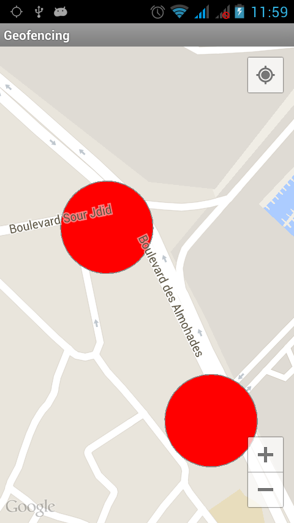

# Geofencing #

Since API Level 21 Geolocation and Geofencing works differently. A sample application can be found [there](https://github.com/vhoen/Geofence-21 "Geofence-21").

I tried to set up a demo app that displays a number of geofence on a map, and do something when a transition (ENTER, EXIT or DWELL) occurs. 

I spent many hours reading the [official documentation](http://developer.android.com/training/location/geofencing.html "official documentation")  along with the [provided sample](http://developer.android.com/shareables/training/GeofenceDetection.zip "provided sample"). 

I was at loss about how to detect a transition. Then I stumbled on this [http://stackoverflow.com/a/19521823](http://stackoverflow.com/a/19521823 "post"), and suddenly it worked.

Creating geofence can be done in [./src/me/hoen/geofencing/SimpleGeofenceDataStore.java](./src/me/hoen/geofencing/SimpleGeofenceDataStore.java "SimpleGeofenceDataStore").

Handling transitions can be done in the aptly named method handleTransitions in [./src/me/hoen/geofencing/SimpleGeofenceDataStore.java](./src/me/hoen/geofencing/SimpleGeofenceDataStore.java "SimpleGeofenceDataStore.java")

# Install #

- Add android-support-v4.jar in "libs"
- [Set up Google Play Services](http://developer.android.com/google/play-services/setup.html "Set up Google Play Services")
- [Add your Google maps API KEY](https://developers.google.com/maps/documentation/android/start#getting_the_google_maps_android_api_v2 "Add your Google maps API KEY") in the [./AndroidManifest.xml](./AndroidManifest.xml "AndroidManifest.xml")

